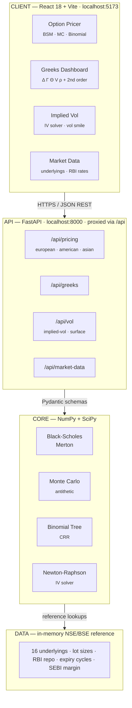

<div align="center">

# 🇮🇳 India Option Pricing Engine

### Professional-grade option pricing for NSE & BSE — built natively for the Indian derivatives market

[](https://www.python.org/)
[](https://fastapi.tiangolo.com/)
[](https://react.dev/)
[](https://vitejs.dev/)
[](#-testing)
[](#-license)

**Currency: INR (₹) · Exchanges: NSE & BSE · Notation: CE/PE**

[Quick Start](#-quick-start) · [Architecture](#-architecture) · [API Reference](#-api-reference) · [Troubleshooting](#-troubleshooting)

</div>

---

## 📖 Overview

The **India Option Pricing Engine** is a full-stack derivatives pricing platform purpose-built for Indian markets. Unlike generic option calculators, every default, unit, and convention here matches what you'd see on an actual NSE option chain — lot sizes, RBI repo rate as risk-free proxy, CE/PE labeling, and India-specific volatility skew.

It prices options three independent ways and shows you all three side by side, so you can sanity-check results against each other instead of trusting a single black-box number.

| Capability | Detail |
|---|---|
| 🧮 **Pricing models** | Black-Scholes-Merton (analytical) · Monte Carlo (antithetic variance reduction) · Binomial Tree (Cox-Ross-Rubinstein) |
| 📐 **Option styles** | European (NSE index options) · American (NSE stock options, early exercise) · Asian (arithmetic & geometric averaging) |
| 🔢 **Greeks** | 1st order — Delta, Gamma, Theta, Vega, Rho · 2nd order — Vanna, Volga, Charm, Speed, Color — all converted to ₹/lot |
| 📊 **Implied volatility** | Newton-Raphson solver from market price · model volatility smile/surface generator |
| 🏛️ **Market data** | 16 pre-loaded NSE/BSE underlyings, lot sizes, RBI repo rate, expiry cycles, SEBI margin notes, circuit breaker levels |
| 💰 **Currency handling** | Every price shown per-unit and per-lot in INR (₹), with lakh/crore-aware formatting |
| ✅ **Test coverage** | 16 unit tests — put-call parity, Monte Carlo convergence, binomial-BSM agreement, Greek sign checks |

---

## 🏗️ Architecture



> 📎 A static rendering of this diagram is also available at [`docs/architecture.svg`](docs/architecture.svg) if your viewer doesn't render Mermaid.

### Request flow example

1. User picks **NIFTY**, sets strike/spot/expiry in the **Option Pricer** tab
2. Frontend `POST`s to `/api/pricing/european` with the payload
3. FastAPI validates input via Pydantic (`OptionInput` schema)
4. `pricing_engine.py` computes BSM, Monte Carlo (50k antithetic paths), and Binomial CRR in parallel
5. Response includes per-unit price, per-lot price (₹), confidence intervals, and Greeks-ready `d1`/`d2`
6. Frontend renders a model comparison table + payoff-at-expiry chart (Recharts)

---

## 📁 Project Structure

```
india-option-pricer/
│
├── backend/                           FastAPI application
│   ├── app/
│   │   ├── main.py                    App entrypoint, CORS, router registration
│   │   ├── api/                       Route handlers (thin — validation + response shaping)
│   │   │   ├── pricing.py             POST /api/pricing/{european,american,asian}
│   │   │   ├── greeks.py              POST /api/greeks
│   │   │   ├── implied_vol.py         POST /api/vol/{implied-vol,vol-surface}
│   │   │   └── market_data.py         GET  /api/market-data/*
│   │   ├── core/
│   │   │   └── pricing_engine.py      BSM · Monte Carlo · Binomial CRR · Greeks (pure functions)
│   │   ├── models/
│   │   │   └── schemas.py             Pydantic request/response contracts
│   │   └── services/
│   │       ├── market_data_service.py NSE/BSE contract specs, RBI rate constants
│   │       └── implied_vol.py         Newton-Raphson solver, vol surface generator
│   ├── tests/
│   │   └── test_pricing.py            16 tests — parity, convergence, Greek sanity checks
│   ├── requirements.txt               Pinned, Windows/Python 3.13–safe (see note below)
│   ├── run.py                         uvicorn launcher
│   └── .env.example
│
├── frontend/                          React 18 + Vite SPA
│   ├── src/
│   │   ├── App.jsx                    Tab navigation shell
│   │   ├── main.jsx                   React DOM entry
│   │   ├── components/
│   │   │   ├── Header.jsx             NSE-blue branded header
│   │   │   ├── OptionForm.jsx         Input form with underlying presets
│   │   │   ├── PricingResult.jsx      Results table + payoff chart (Recharts)
│   │   │   └── ui.jsx                 Shared primitives (Card, StatBox, Badge…)
│   │   ├── pages/
│   │   │   ├── PricerPage.jsx
│   │   │   ├── GreeksPage.jsx
│   │   │   ├── ImpliedVolPage.jsx
│   │   │   └── MarketDataPage.jsx
│   │   └── utils/
│   │       ├── api.js                 Typed fetch wrapper for all endpoints
│   │       └── format.js              ₹ / lakh / crore formatting helpers
│   ├── index.html
│   ├── vite.config.js                 Dev server + /api proxy to :8000
│   └── package.json
│
├── docs/
│   └── architecture.svg               Static architecture diagram
│
├── start.sh                           One-command launcher (macOS/Linux)
├── start.bat                          One-command launcher (Windows)
├── .gitignore
└── README.md                          You are here
```

---

## ✅ Prerequisites

| Tool | Minimum version | Check with | Get it |
|---|---|---|---|
| Python | 3.10 (3.13 supported) | `python --version` | [python.org](https://python.org) |
| Node.js | 18 | `node --version` | [nodejs.org](https://nodejs.org) |
| pip | latest | `pip --version` | ships with Python |
| npm | 9+ | `npm --version` | ships with Node.js |

> ⚠️ **Python 3.13 + Windows users:** make sure you're on the `requirements.txt` shipped with this version of the repo (NumPy ≥ 2.0, SciPy ≥ 1.14). Older pins (`scipy==1.13.0`) try to compile from source on Windows and fail with a Fortran-compiler error — see [Troubleshooting](#-troubleshooting).

---

## 🚀 Quick Start

### Option A — One command (macOS/Linux)

```bash
git clone <repo-url> india-option-pricer
cd india-option-pricer
bash start.sh
```

### Option A — One command (Windows)

```powershell
git clone <repo-url> india-option-pricer
cd india-option-pricer
.\start.bat
```

> Note the leading `.\` — PowerShell doesn't run scripts from the current folder by default.

Both scripts create the virtual environment, install dependencies, and launch backend + frontend together.

### Option B — Manual setup (recommended if Option A has issues)

**Terminal 1 — Backend**

```bash
cd india-option-pricer/backend
python -m venv venv
```

Activate the environment (pick your shell):

```bash
# macOS / Linux
source venv/bin/activate

# Windows — Command Prompt
venv\Scripts\activate.bat

# Windows — PowerShell
venv\Scripts\Activate.ps1
```

> If PowerShell blocks the activation script with an execution-policy error, run this once:
> `Set-ExecutionPolicy -ExecutionPolicy RemoteSigned -Scope CurrentUser`

```bash
pip install -r requirements.txt
python run.py
```

You should see:

```
INFO:     Uvicorn running on http://0.0.0.0:8000
INFO:     Application startup complete.
```

Leave this terminal running.

**Terminal 2 — Frontend** (open a new terminal window)

```bash
cd india-option-pricer/frontend
npm install
npm run dev
```

You should see:

```
  VITE v5.x.x  ready in 400ms
  ➜  Local:   http://localhost:5173/
```

**Open the app:** [http://localhost:5173](http://localhost:5173)
**Open the API docs:** [http://localhost:8000/api/docs](http://localhost:8000/api/docs)

### Verifying the backend independently

```bash
curl http://localhost:8000/health
# → {"status":"ok"}

curl http://localhost:8000/
# → {"service":"India Option Pricing Engine","version":"2.0.0",...}
```

---

## 🧪 Testing

```bash
cd backend
source venv/bin/activate          # Windows: venv\Scripts\Activate.ps1
pip install pytest
python -m pytest tests/ -v
```

<details>
<summary><strong>Expected output (16/16 passing)</strong></summary>

```
tests/test_pricing.py::TestBSM::test_atm_call_put_parity                  PASSED
tests/test_pricing.py::TestBSM::test_deep_itm_call_approaches_intrinsic   PASSED
tests/test_pricing.py::TestBSM::test_nifty_atm_example                    PASSED
tests/test_pricing.py::TestBSM::test_zero_vol_boundary                    PASSED
tests/test_pricing.py::TestMonteCarlo::test_convergence_to_bsm            PASSED
tests/test_pricing.py::TestMonteCarlo::test_std_error_decreases_with_sims PASSED
tests/test_pricing.py::TestBinomial::test_european_matches_bsm            PASSED
tests/test_pricing.py::TestBinomial::test_american_put_ge_european        PASSED
tests/test_pricing.py::TestGreeks::test_call_delta_range                  PASSED
tests/test_pricing.py::TestGreeks::test_put_delta_range                   PASSED
tests/test_pricing.py::TestGreeks::test_delta_put_call_relationship       PASSED
tests/test_pricing.py::TestGreeks::test_gamma_positive                    PASSED
tests/test_pricing.py::TestGreeks::test_vega_positive                     PASSED
tests/test_pricing.py::TestGreeks::test_theta_negative_for_long           PASSED
tests/test_pricing.py::TestAsian::test_asian_call_less_than_european      PASSED
tests/test_pricing.py::TestAsian::test_geometric_less_than_arithmetic     PASSED

============================== 16 passed in 3.0s ==============================
```

</details>

What's actually being verified: put-call parity holds exactly under BSM; Monte Carlo converges to the BSM price within 2 standard errors as simulation count grows; the Binomial tree agrees with BSM for European exercise; American puts price at or above their European counterpart (early-exercise premium); call delta stays in (0,1) and put delta in (-1,0); theta is negative for long positions; Asian options price below equivalent European options (averaging reduces effective volatility).

---

## 📡 API Reference

Base URL: `http://localhost:8000` · Interactive docs: `http://localhost:8000/api/docs`

### Pricing — `POST /api/pricing/*`

| Endpoint | Use case | Models returned |
|---|---|---|
| `/api/pricing/european` | NSE index options (Nifty, Bank Nifty, Sensex) | BSM + Monte Carlo + Binomial |
| `/api/pricing/american` | NSE stock options (early exercise since Oct 2019) | Binomial CRR (primary) + BSM/MC as European lower bound |
| `/api/pricing/asian` | Path-dependent average-price options | Monte Carlo (arithmetic or geometric averaging) |

<details>
<summary><strong>Example — price a Nifty ATM call (European)</strong></summary>

```bash
curl -X POST http://localhost:8000/api/pricing/european \
  -H "Content-Type: application/json" \
  -d '{
    "underlying": "NIFTY",
    "spot_price": 19500,
    "strike_price": 19500,
    "time_to_expiry": 0.0822,
    "volatility": 0.14,
    "risk_free_rate": 0.065,
    "dividend_yield": 0.0,
    "option_type": "CE",
    "exercise_style": "european",
    "lot_size": 50,
    "num_simulations": 50000
  }'
```

```jsonc
{
  "bsm":         { "call_price": 368.93, "call_price_inr": 18446.50, "d1": 0.234, "d2": 0.193 },
  "monte_carlo": { "call_price": 367.12, "call_std_error": 1.58, "num_simulations": 50000 },
  "binomial":    { "call_price": 368.53, "num_steps": 200 }
}
```

</details>

### Greeks — `POST /api/greeks`

```bash
curl -X POST http://localhost:8000/api/greeks \
  -H "Content-Type: application/json" \
  -d '{
    "spot_price": 19500, "strike_price": 19500,
    "time_to_expiry": 0.0822, "volatility": 0.14,
    "risk_free_rate": 0.065, "dividend_yield": 0.0,
    "lot_size": 50, "option_type": "CE",
    "exercise_style": "european", "num_simulations": 1000
  }'
```

Returns delta, gamma, theta, vega, rho, plus vanna, volga, charm, speed, color — each scaled to ₹/lot using your `lot_size`.

### Implied volatility — `POST /api/vol/implied-vol`

```bash
curl -X POST http://localhost:8000/api/vol/implied-vol \
  -H "Content-Type: application/json" \
  -d '{
    "market_price": 368,
    "spot_price": 19500, "strike_price": 19500,
    "time_to_expiry": 0.0822,
    "risk_free_rate": 0.065, "dividend_yield": 0.0,
    "option_type": "CE"
  }'
```

### Market data — `GET /api/market-data/*`

```bash
curl http://localhost:8000/api/market-data/underlyings           # all 16 underlyings
curl http://localhost:8000/api/market-data/underlyings/BANKNIFTY # one symbol
curl http://localhost:8000/api/market-data/rbi-rates             # repo rate reference
curl http://localhost:8000/api/market-data/nse-info              # circuit breakers, settlement rules
```

---

## 🇮🇳 Indian Market Reference

### Pre-loaded underlyings

| Symbol | Exchange | Lot size | Style |
|---|---|---|---|
| NIFTY | NSE | 50 | European |
| BANKNIFTY | NSE | 15 | European |
| FINNIFTY | NSE | 40 | European |
| MIDCPNIFTY | NSE | 75 | European |
| SENSEX | BSE | 10 | European |
| RELIANCE | NSE | 250 | American |
| TCS | NSE | 150 | American |
| HDFCBANK | NSE | 550 | American |
| INFY | NSE | 400 | American |
| ICICIBANK | NSE | 700 | American |
| SBIN | NSE | 1500 | American |
| BAJFINANCE | NSE | 125 | American |
| TATAMOTORS | NSE | 1425 | American |
| WIPRO | NSE | 1500 | American |
| HINDUNILVR | NSE | 300 | American |
| ADANIENT | NSE | 300 | American |

> ⚠️ NSE revises lot sizes periodically as share prices change. Always verify current contract specs at [nseindia.com](https://www.nseindia.com/products-services/equity-derivatives-fno-contract) before trading on these numbers.

### Conventions this engine follows

- **Risk-free rate** → RBI repo rate (currently ~6.5%, enter as `0.065`). Verify live at [rbi.org.in](https://rbi.org.in).
- **CE / PE notation** → NSE labels calls "CE" and puts "PE", not "C"/"P" as in US markets.
- **Index options are European**, settled in cash at 15:30 IST on expiry day.
- **Stock options are American** (early exercise allowed) and physically settled, a rule change effective October 2019.
- **Expiry cycles**: Nifty — monthly (last Thursday) + weekly (every Thursday); Bank Nifty — monthly (last Thursday) + weekly (every Wednesday); stock options — monthly only.

---

## 🛠️ Troubleshooting

<details>
<summary><strong>SciPy fails to install on Windows — "Unknown compiler(s): ifort, gfortran…"</strong></summary>

This happens when `requirements.txt` pins `scipy==1.13.0`, which has no pre-built wheel for newer Python versions (3.13) on Windows, so pip tries to compile it from source and needs a Fortran compiler you don't have.

**Fix:** make sure your `requirements.txt` uses these unpinned-floor versions instead, which ship as ready-made wheels:

```
fastapi==0.115.0
uvicorn[standard]==0.30.6
pydantic==2.9.2
numpy>=2.0.0
scipy>=1.14.0
python-dotenv==1.0.1
httpx==0.27.0
```

Then re-run `pip install -r requirements.txt` — no compiler needed.

</details>

<details>
<summary><strong>Backend won't start — ModuleNotFoundError</strong></summary>

Your virtual environment probably isn't active, or dependencies didn't finish installing.

```bash
source venv/bin/activate     # Windows: venv\Scripts\Activate.ps1
pip install -r requirements.txt
python run.py
```

</details>

<details>
<summary><strong>Frontend shows "Failed to fetch" / network errors</strong></summary>

Confirm the backend is actually running and reachable:

```bash
curl http://localhost:8000/health
```

Vite's dev server proxies `/api/*` requests to `localhost:8000` automatically (see `vite.config.js`) — if the backend isn't up, every API call in the UI will fail.

</details>

<details>
<summary><strong>PowerShell errors: "&& is not a valid statement separator" or "command not recognized"</strong></summary>

PowerShell doesn't support chaining commands with `&&` the way bash does — run each command on its own line. And PowerShell won't execute a script from the current folder unless you prefix it with `.\`:

```powershell
.\start.bat        # not just start.bat
```

</details>

<details>
<summary><strong>venv\Scripts\Activate.ps1 is blocked by execution policy</strong></summary>

```powershell
Set-ExecutionPolicy -ExecutionPolicy RemoteSigned -Scope CurrentUser
venv\Scripts\Activate.ps1
```

</details>

<details>
<summary><strong>python command not found on Windows</strong></summary>

Try the Windows launcher instead:

```powershell
py -m venv venv
py run.py
```

</details>

<details>
<summary><strong>Port 8000 or 5173 already in use</strong></summary>

Change the backend port in `backend/run.py`:

```python
uvicorn.run("app.main:app", host="0.0.0.0", port=8001, reload=True)
```

And the frontend proxy in `frontend/vite.config.js`:

```js
server: { port: 5174, proxy: { '/api': 'http://localhost:8001' } }
```

</details>

---

## 🚢 Production Deployment

**Backend — uvicorn behind gunicorn**

```bash
pip install gunicorn
gunicorn app.main:app -w 4 -k uvicorn.workers.UvicornWorker --bind 0.0.0.0:8000
```

**Frontend — static build**

```bash
cd frontend
npm run build       # outputs to frontend/dist/
# serve dist/ with nginx, Vercel, Netlify, or any static host
```

**Lock down CORS** in `backend/app/main.py` before going live:

```python
app.add_middleware(
    CORSMiddleware,
    allow_origins=["https://your-production-domain.com"],
    ...
)
```

---

## ⚠️ Disclaimer

This project is for **educational and research purposes only** and does not constitute financial advice or a recommendation to buy, sell, or hold any security or derivative instrument.

- Pricing models rely on simplifying assumptions (constant volatility, frictionless markets, lognormal returns) that don't always hold in real markets.
- Lot sizes, expiry dates, and contract specifications shown here are reference values and change periodically — always verify current specs on NSE/BSE before placing any trade.
- The RBI repo rate is used as a risk-free proxy; it may not match your actual cost of capital.
- Past pricing accuracy does not guarantee future accuracy.

Consult a SEBI-registered investment advisor before making investment decisions.

---

## 📄 License

MIT License — free to use, modify, and distribute with attribution.

<div align="center">

Made for the Indian derivatives market · NSE · BSE · ₹

</div>
